HOUSE SPECIFICATIONS:
- Price : 5740000
- Area : 4640
- Number of bedrooms : 4
- Number of bathrooms : 1
- Number of storeys: 2
- Located on the main road
- There is no a guest room
- There is no a basement
- Hot water heating is not connected
- Air conditioning is not connected
- Number of parking places : 1
- Not a preffered area
- semi-furnished

🏡 Welcome to your dream home! 🌟 This stunning property is waiting to be called yours. With 4 spacious bedrooms and 1 luxurious bathroom, this 2-storey gem offers the perfect space for you and your loved ones to create lifelong memories. 💫

Located on the main road, this house provides easy access to all the amenities you need. Imagine the convenience of having everything within reach! 🚗

Although there is no guest room or basement, this home is designed to maximize your comfort and style. The semi-furnished interior allows you to add your personal touch and make it truly yours. ✨

While hot water heating and air conditioning are not connected, this presents a unique opportunity for you to customize your home to suit your preferences. Imagine the excitement of creating your own oasis! ☀️

With a parking place for your convenience, you'll never have to worry about finding a spot. 🚘

Priced at $5,740,000, this property offers incredible value for its size and location. 💰 Don't miss out on this opportunity to make your dreams come true! 💭

#realestate #dreamhome #forsale #property #realestateforsale #homeforsale #luxuryrealestate #housegoals #househunting #housesofinstagram
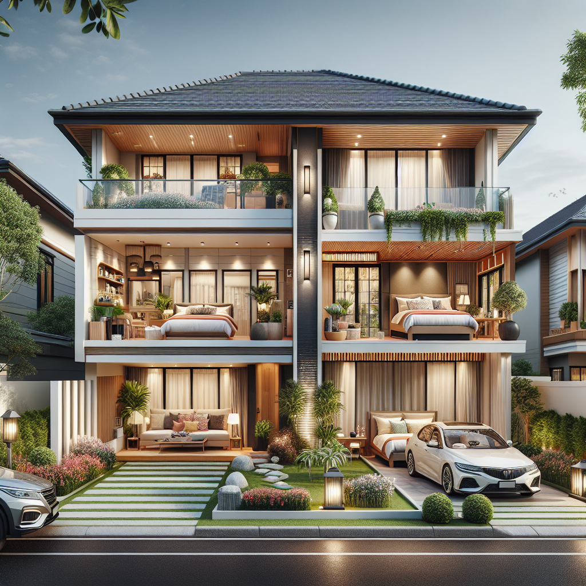
------------------------
HOUSE SPECIFICATIONS:
- Price : 7000000
- Area : 11175
- Number of bedrooms : 3
- Number of bathrooms : 1
- Number of storeys: 1
- Located on the main road
- There is no a guest room
- There is a basement
- Hot water heating is not connected
- Air conditioning is connected
- Number of parking places : 1
- Preferred area
- furnished

🏡 Welcome to your dream home! 🌟 This stunning property is everything you've been searching for. With a price of $7,000,000, it offers incredible value for its exceptional features. Let's dive into the details! 

Located on the main road, this spacious house spans an impressive area of 11,175 square feet. Perfect for a growing family, it boasts 3 bedrooms and 1 bathroom, providing ample space for everyone to relax and unwind. 

Step inside and be captivated by the open layout, designed to maximize natural light and create a warm, inviting atmosphere. The absence of a guest room ensures that your privacy is never compromised, while the basement offers endless possibilities for customization. 

Although hot water heating is not connected, worry not! The house is equipped with air conditioning, ensuring your comfort all year round. Plus, with a dedicated parking place, you'll never have to worry about finding a spot for your vehicle. 

This preferred area is known for its convenience and accessibility, making it the perfect place to call home. And the best part? It comes fully furnished, so you can move in and start creating memories right away. 

Don't miss out on this incredible opportunity! 🏡💫 Contact us today to schedule a viewing and make this house your own. #realestate #dreamhome #forsale #property #realestateforsale #homeforsale #luxuryrealestate #housegoals #househunting #housesofinstagram
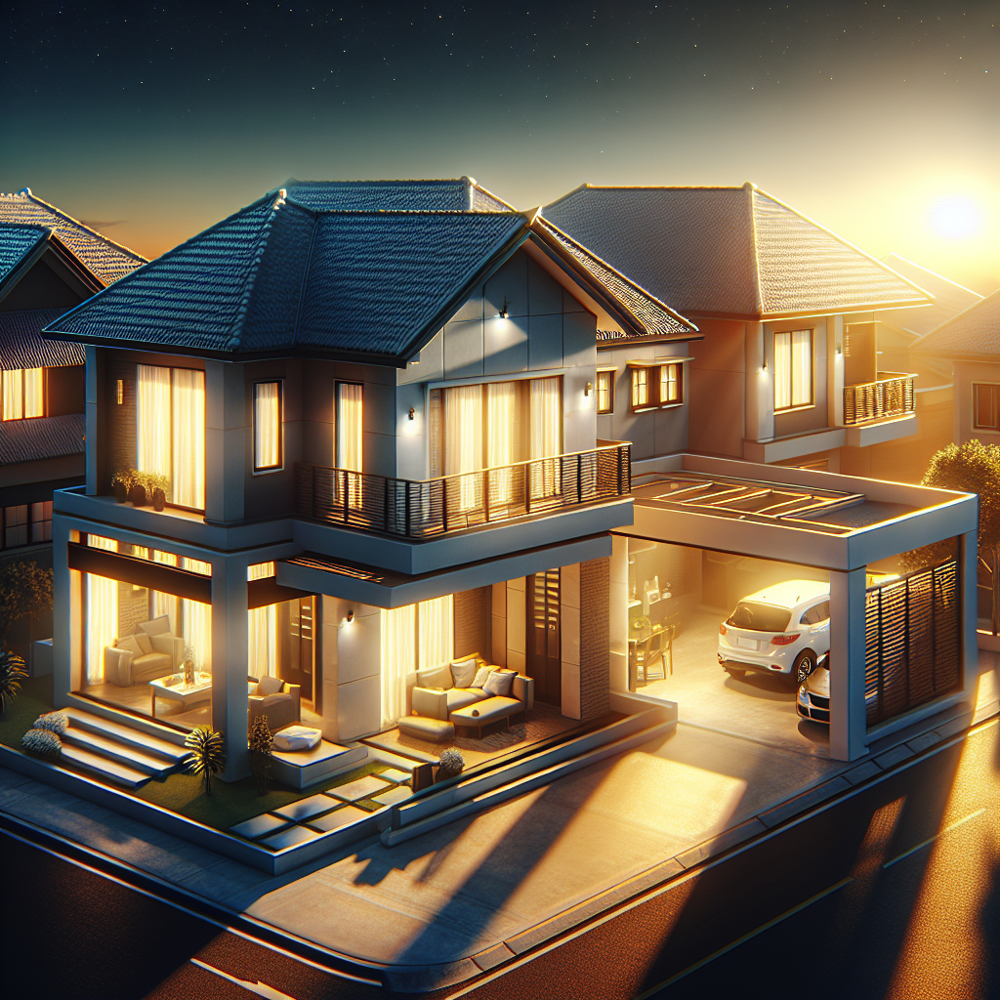
------------------------
HOUSE SPECIFICATIONS:
- Price : 4473000
- Area : 3510
- Number of bedrooms : 3
- Number of bathrooms : 1
- Number of storeys: 2
- Located on the main road
- There is no a guest room
- There is no a basement
- Hot water heating is not connected
- Air conditioning is not connected
- Number of parking places : 0
- Not a preffered area
- semi-furnished

🏡 Welcome to your dream home! 🌟 This stunning property is located on the main road, offering easy access to all the amenities you need. With 3 spacious bedrooms and 1 bathroom, this 2-storey gem is perfect for creating unforgettable memories with your loved ones. 💫

Step inside and be amazed by the open layout, allowing natural light to flood every corner. Imagine cozying up in the living room, enjoying the warmth of a crackling fireplace during chilly evenings. ❄️ Although it's not fully furnished, you have the opportunity to design and personalize each room to match your unique style and taste. 🎨

While this home doesn't have a guest room or a basement, it compensates with its incredible price of $4,473,000. 💰 Plus, you'll have the chance to add your own touch by connecting hot water heating and air conditioning systems. Imagine the comfort and convenience! ☀️❄️

Don't worry about parking, as there are plenty of options nearby. And even though it's not in a preferred area, this house offers incredible potential and value. 🌟

Ready to make this house your forever home? 🏡 Don't miss out on this amazing opportunity! Contact us today to schedule a viewing and start living your #housegoals. 🌈💫 #realestateforsale #dreamhome #property #househunting #homeforsale
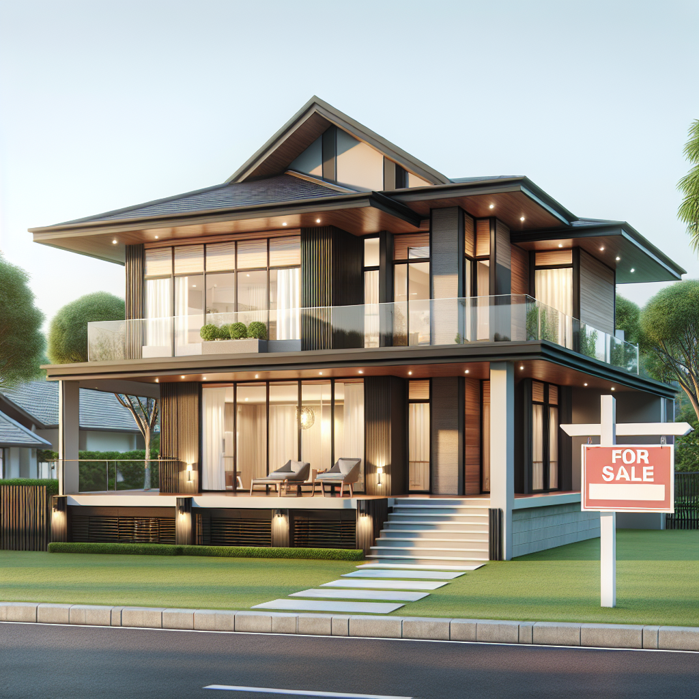
------------------------
HOUSE SPECIFICATIONS:
- Price : 5950000
- Area : 6540
- Number of bedrooms : 3
- Number of bathrooms : 1
- Number of storeys: 1
- Located on the main road
- There is a guest room
- There is a basement
- Hot water heating is not connected
- Air conditioning is not connected
- Number of parking places : 2
- Preferred area
- furnished

🏡 Welcome to your dream home! 🌟 This stunning property is a true gem, located on the main road in a preferred area. With 3 spacious bedrooms, 1 bathroom, and a guest room, this house is perfect for creating unforgettable memories with your loved ones. 💫

Step inside and be amazed by the open layout and abundance of natural light that fills every corner. The furnished interiors exude elegance and style, offering a seamless blend of comfort and sophistication. ✨

Imagine hosting gatherings in the spacious living area or enjoying cozy nights in the basement, where endless possibilities await. 🎉

Although hot water heating and air conditioning are not currently connected, you have the freedom to customize this home to your heart's desire. 🛠️

With 2 parking places available, convenience is at your fingertips. 🚗

Don't miss out on this incredible opportunity to make this house your forever home. 💖

💰 Price: $5,950,000
📐 Area: 6,540 sqft
🛏️ Bedrooms: 3
🛁 Bathrooms: 1
🏢 Storeys: 1

Contact us now to schedule a viewing and start living your dream life! 📲🔑

#realestate #dreamhome #forsale #property #realestateforsale #homeforsale #luxuryrealestate #housegoals #househunting #housesofinstagram
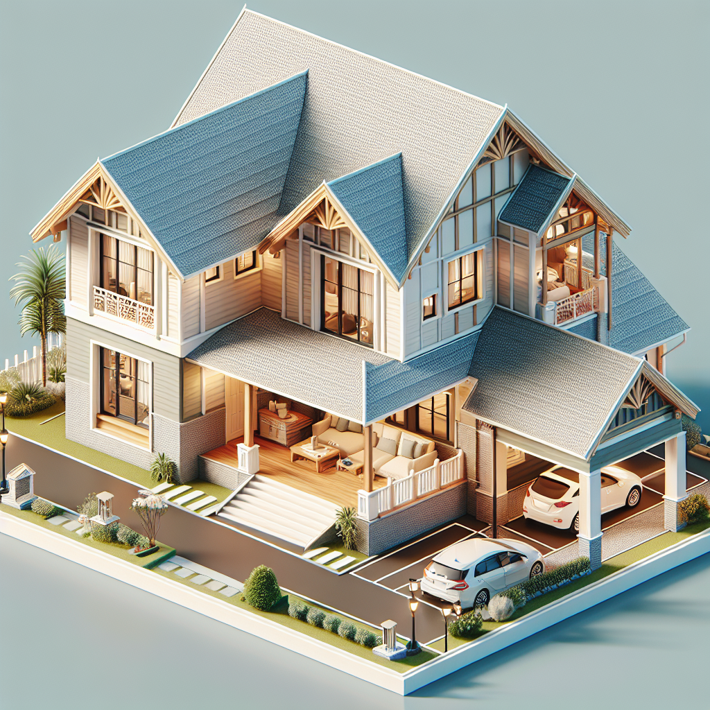
------------------------
HOUSE SPECIFICATIONS:
- Price : 2590000
- Area : 3600
- Number of bedrooms : 2
- Number of bathrooms : 1
- Number of storeys: 1
- Located on the main road
- There is no a guest room
- There is no a basement
- Hot water heating is not connected
- Air conditioning is not connected
- Number of parking places : 0
- Not a preffered area
- unfurnished

🏡 Welcome to your dream home! 🌟 This stunning property is a hidden gem waiting for you to make it your own. With a price of $2,590,000, it offers incredible value for its 3600 sqft area. 😍

🛏️ This cozy haven features 2 spacious bedrooms, pr crerfect foeating your own personal sanctuary. 🛀 You'll find a luxurious bathroom that will make you feel like you're in a spa retreat. 🚿

🏠 Nestled on the main road, this home offers convenience and easy access to all your favorite amenities. 🏞️ Although there is no guest room or basement, this property is brimming with potential to be transformed into your dream space. 💫

❄️ While hot water heating and air conditioning are not currently connected, imagine the possibilities of customizing this home to suit your unique style and preferences. 💭

🚗 Although there are no parking places, don't let that deter you! With its prime location and endless possibilities, this property is a true diamond in the rough. 💎

🌟 Don't miss out on the opportunity to turn this house into your forever home. 🏡✨ Contact us today to schedule a viewing and start your journey towards creating the life you've always dreamed of. 🌈💫

#realestate #dreamhome #forsale #property #realestateforsale #homeforsale #housegoals #househunting #housesofinstagram
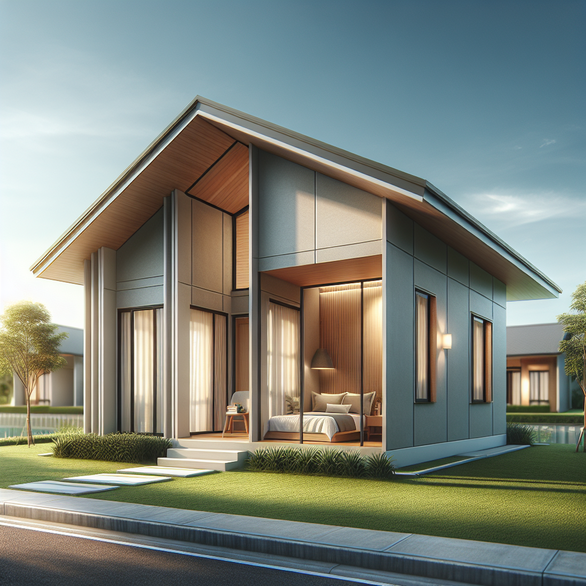
------------------------
HOUSE SPECIFICATIONS:
- Price : 3087000
- Area : 8100
- Number of bedrooms : 2
- Number of bathrooms : 1
- Number of storeys: 1
- Located on the main road
- There is no a guest room
- There is no a basement
- Hot water heating is not connected
- Air conditioning is not connected
- Number of parking places : 1
- Not a preffered area
- unfurnished

Welcome to your dream home! 🏡✨ This stunning property is waiting for you to make it your own. With a price of just $3,087,000, it offers incredible value for a spacious 8100 sqft area. 😍

Imagine waking up in one of the two cozy bedrooms, ready to start your day in this peaceful haven. 💤💭 The single-storey design ensures easy access throughout the house, making it perfect for those seeking convenience and comfort. 🚶‍♀️🚶‍♂️

Located on the main road, this home offers both accessibility and privacy. 🛣️🌳 And while there may not be a guest room or basement, the possibilities for customization are endless. 🎨✨

Although hot water heating and air conditioning are not currently connected, you have the freedom to design your own climate control system. 🌡️❄️☀️ And with one parking place available, your car will always have a safe spot to rest. 🚗💨

Don't miss out on this incredible opportunity to create your dream home in this sought-after area. 🌟💫 With endless potential and an affordable price, this unfurnished gem is just waiting for you to add your personal touch. 💎💖

Ready to make this house your forever home? Contact us today to schedule a viewing! 📞🏡💼

#realestate #dreamhome #forsale #property #realestateforsale #homeforsale #luxuryrealestate #housegoals #househunting #housesofinstagram
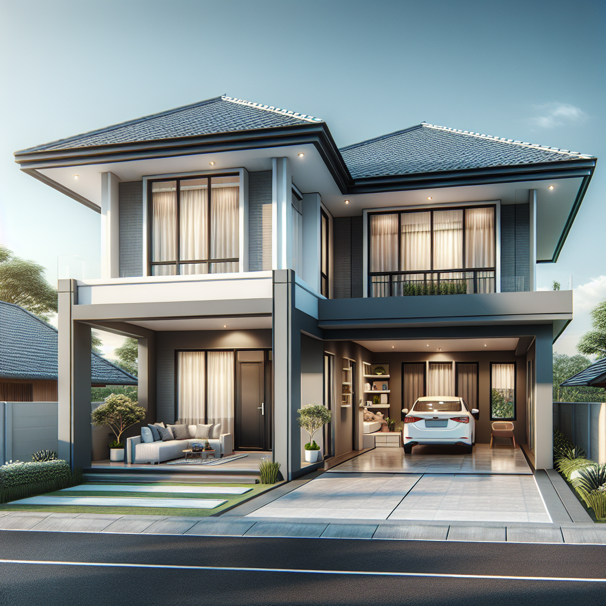
------------------------
HOUSE SPECIFICATIONS:
- Price : 2940000
- Area : 6615
- Number of bedrooms : 3
- Number of bathrooms : 1
- Number of storeys: 2
- Located on the main road
- There is no a guest room
- There is no a basement
- Hot water heating is not connected
- Air conditioning is not connected
- Number of parking places : 0
- Not a preffered area
- semi-furnished

🏡 Welcome to your dream home! 🏡

Escape to this stunning 2-storey gem located on the main road, where luxury meets comfort. With 3 spacious bedrooms and 1 bathroom, this semi-furnished beauty is perfect for those seeking a cozy retreat. 

✨ Imagine waking up to the warm embrace of natural light flooding through the windows, as you sip your morning coffee in the heart of your new home. ✨

Although there is no guest room or basement, this haven boasts a generous area of 6615 square feet, providing ample space for you to create unforgettable memories with loved ones. 

💦 While hot water heating and air conditioning are not currently connected, don't let that deter you! Embrace the opportunity to customize this space to your liking, adding your personal touch to every corner. 💦

Although there are no parking places, this property's prime location ensures convenience is just a step away. Explore the vibrant neighborhood, indulge in local cuisine, and immerse yourself in the rich culture that surrounds you.

🌟 Don't miss out on this incredible opportunity to make this house your forever home. 🌟

💰 Priced at $2,940,000, this is your chance to live the life you've always dreamed of. 💰

🔑 Contact us today to unlock the door to your future. 🔑

#realestate #dreamhome #forsale #property #realestateforsale #homeforsale #luxuryrealestate #housegoals #househunting #housesofinstagram
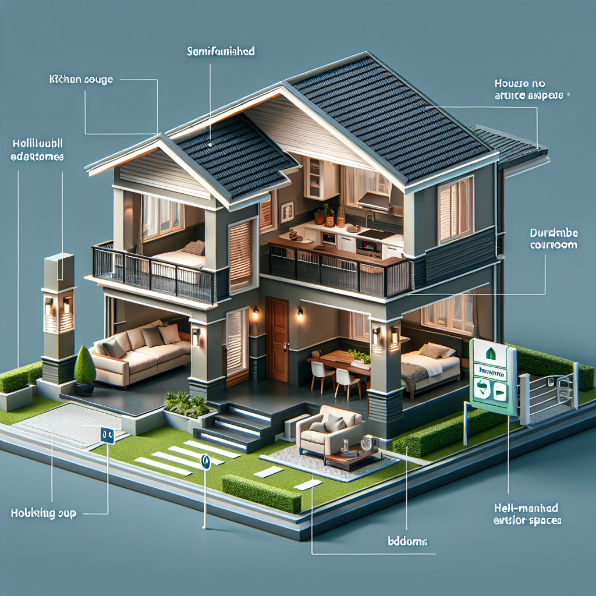
------------------------
HOUSE SPECIFICATIONS:
- Price : 3500000
- Area : 3650
- Number of bedrooms : 3
- Number of bathrooms : 1
- Number of storeys: 2
- Located on the main road
- There is no a guest room
- There is no a basement
- Hot water heating is not connected
- Air conditioning is not connected
- Number of parking places : 0
- Not a preffered area
- unfurnished

Welcome to your dream home! 🏡✨ This stunning property is waiting for you to make it your own. With a price of $3,500,000, this house offers incredible value for its impressive features. 

Spanning across an area of 3650 square feet, this spacious home boasts 3 bedrooms and 1 bathroom, providing ample space for you and your loved ones. The 2-storey design adds a touch of elegance and charm to the overall aesthetic.

Conveniently located on the main road, this house offers easy access to all the amenities you need. Imagine the convenience of having everything you need just a stone's throw away! 

While there may not be a guest room or a basement, the possibilities for customization are endless. Create a space that truly reflects your unique style and personality.

Although hot water heating and air conditioning are not currently connected, you have the opportunity to tailor these features to your preferences. Imagine the comfort and coziness you can create in your new home!

While there may not be any parking places available, don't let that deter you. With the perfect location, you'll have plenty of options for parking nearby.

This house may be unfurnished, but that just means you have a blank canvas to transform it into your dream oasis. Let your imagination run wild and bring your vision to life.

Don't miss out on this incredible opportunity! Contact us today to schedule a viewing and make this house your forever home. 📞💫

#realestate #dreamhome #forsale #property #realestateforsale #homeforsale #luxuryrealestate #housegoals #househunting #housesofinstagram
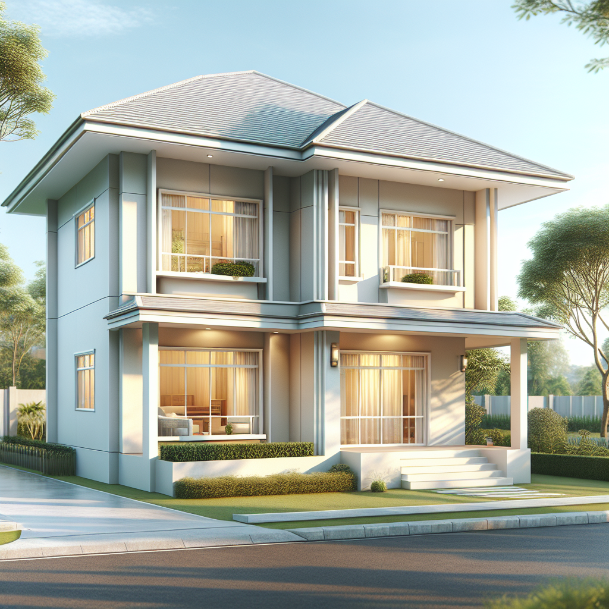
------------------------
HOUSE SPECIFICATIONS:
- Price : 4865000
- Area : 4350
- Number of bedrooms : 2
- Number of bathrooms : 1
- Number of storeys: 1
- Located on the main road
- There is no a guest room
- There is a basement
- Hot water heating is not connected
- Air conditioning is not connected
- Number of parking places : 0
- Not a preffered area
- unfurnished

🏡 Welcome to your dream home! 🏡

Introducing this stunning property located on the main road, offering convenience and accessibility at its finest. With 4350 square feet of space, this spacious home is perfect for those seeking a cozy yet luxurious lifestyle. 

💰 Priced at just $4,865,000, this gem is a steal! 💰

Featuring 2 bedrooms and 1 bathroom, this single-storey home is designed to provide comfort and functionality. The basement offers additional space for storage or can be transformed into your personal sanctuary. While it may not have a guest room, this house is perfect for creating memories with loved ones.

🔥 Imagine the possibilities! 🔥

Although hot water heating and air conditioning are not connected, you have the opportunity to customize this home to your liking. Let your creativity run wild and turn this blank canvas into your dream oasis.

🚗 While there are no parking places available, the prime location ensures easy access to nearby amenities and attractions. 🚗

Don't miss out on this incredible opportunity to own a piece of luxury real estate. Contact us today to schedule a viewing and make this house your forever home! 🏡💫

#realestate #dreamhome #forsale #property #realestateforsale #homeforsale #luxuryrealestate #housegoals #househunting #housesofinstagram
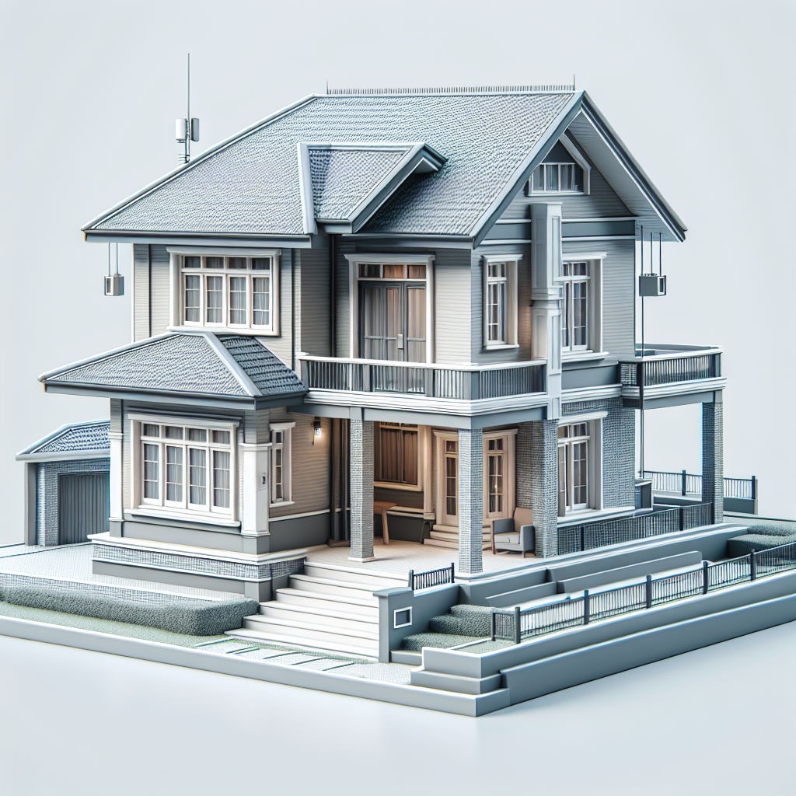
------------------------
HOUSE SPECIFICATIONS:
- Price : 6300000
- Area : 9000
- Number of bedrooms : 3
- Number of bathrooms : 1
- Number of storeys: 1
- Located on the main road
- There is no a guest room
- There is a basement
- Hot water heating is not connected
- Air conditioning is not connected
- Number of parking places : 1
- Preferred area
- furnished

🏡 Welcome to your dream home! 🌟 This stunning property is the epitome of luxury living. With a price of $6,300,000, it offers an incredible value for its impressive features. 🤩

Situated on a spacious 9000 sqft area, this single-storey home boasts 3 cozy bedrooms and 1 elegant bathroom. 🛏️🛁 The main road location ensures easy access to all amenities, making your daily commute a breeze. 🚗💨

Step inside and be amazed by the attention to detail. Although there is no guest room, the basement provides ample space for all your storage needs. 📦✨

While hot water heating and air conditioning are not currently connected, imagine the possibilities of customizing this home to your exact preferences. 💭❄️☀️

Parking will never be an issue with the included parking place. 🚘🅿️

Located in a preferred area, this furnished property is ready for you to move in and make it your own. 🏠✨

Don't miss out on this incredible opportunity! Start living your #housegoals today. 🌟💫

#realestate #dreamhome #forsale #property #realestateforsale #homeforsale #luxuryrealestate #housegoals #househunting #housesofinstagram
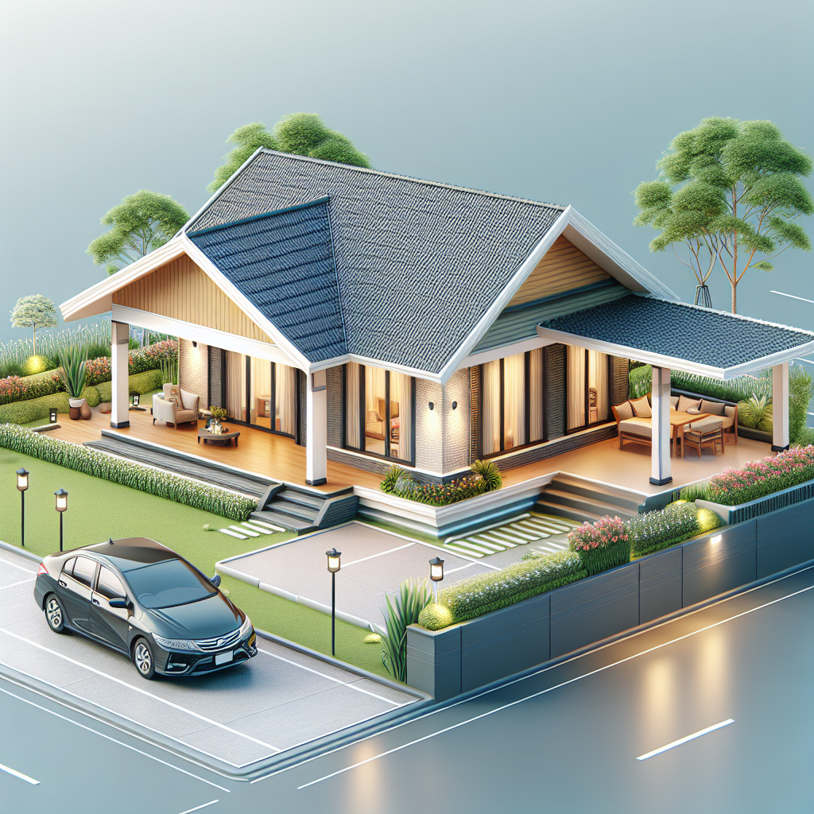
------------------------
HOUSE SPECIFICATIONS:
- Price : 2660000
- Area : 3630
- Number of bedrooms : 3
- Number of bathrooms : 3
- Number of storeys: 2
- It is not located on the main road
- There is a guest room
- There is no a basement
- Hot water heating is not connected
- Air conditioning is not connected
- Number of parking places : 0
- Not a preffered area
- unfurnished

Welcome to your dream home! 🏡✨ This stunning property is waiting for you to make it your own. With 3 spacious bedrooms and 3 luxurious bathrooms, there's plenty of room for you and your loved ones to create lasting memories. 🛌🛀

Step inside and be greeted by the warm and inviting atmosphere of this two-story beauty. The open floor plan allows for seamless flow between the living spaces, perfect for entertaining guests or simply enjoying quality time with your family. 🌟

Although it's not located on the main road, this hidden gem offers privacy and tranquility that is hard to find in the bustling city. 🌳🌿 And don't worry, there's a guest room for your friends and family to stay whenever they visit. 🏡👥

While it may not have a basement, this home is filled with endless possibilities. Imagine turning the extra space into a cozy home office or a playroom for your little ones. 🎨📚

Although hot water heating and air conditioning are not currently connected, you have the opportunity to customize this home to your exact preferences. 💡💨

While there are no parking places available, the surrounding area offers ample parking options. 🚗🅿️

This property is unfurnished, allowing you to bring your personal style and create the home of your dreams. 🎨✨

Don't miss out on this incredible opportunity! Contact us today to schedule a viewing and start envisioning your future in this beautiful home. 📞🔑

#realestate #dreamhome #forsale #property #realestateforsale #homeforsale #luxuryrealestate #housegoals #househunting #housesofinstagram
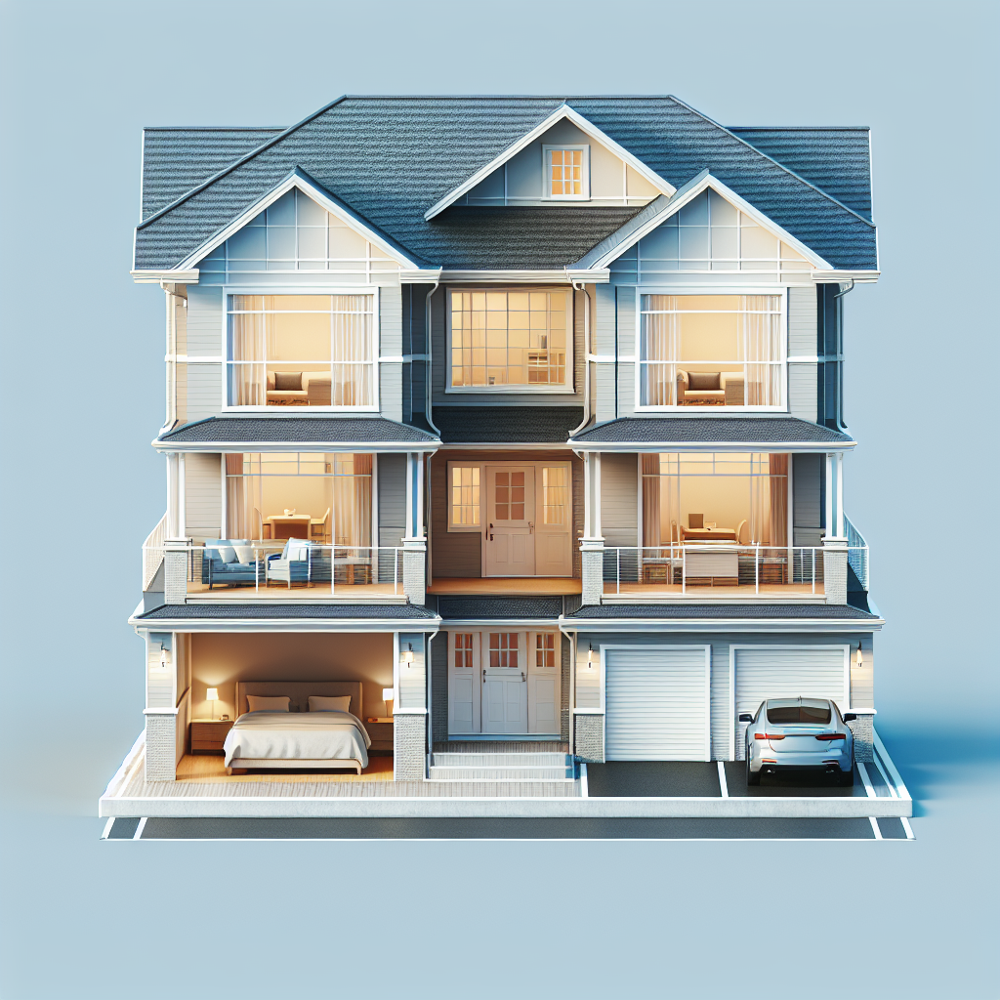
------------------------
HOUSE SPECIFICATIONS:
- Price : 8400000
- Area : 5500
- Number of bedrooms : 4
- Number of bathrooms : 2
- Number of storeys: 2
- Located on the main road
- There is no a guest room
- There is a basement
- Hot water heating is not connected
- Air conditioning is connected
- Number of parking places : 1
- Preferred area
- semi-furnished

🏡 Welcome to your dream home! 🌟 This luxurious property is a true gem, ready to fulfill all your desires. With a price of $8,400,000, this house offers an exquisite blend of elegance and comfort. 😍

Featuring a spacious area of 5500 square feet, this home boasts 4 cozy bedrooms and 2 modern bathrooms, providing ample space for you and your loved ones. 🛏️🛀 The two-storey design adds a touch of grandeur, while the main road location ensures easy accessibility to all your favorite destinations. 🛣️

Step inside and be amazed by the stunning architecture. Although there is no guest room, the basement provides additional space for your imagination to run wild. 🏰✨

While hot water heating is not connected, worry not! The air conditioning is fully functional, ensuring a comfortable environment all year round. ❄️☀️

With one parking place available, convenience is at your fingertips. 🚗💨

This semi-furnished home is situated in a preferred area, offering a perfect blend of tranquility and proximity to amenities. 🌳🏢

Don't miss out on this incredible opportunity! Start living your dreams today. 💫💭

#realestate #dreamhome #forsale #property #realestateforsale #homeforsale #luxuryrealestate #housegoals #househunting #housesofinstagram
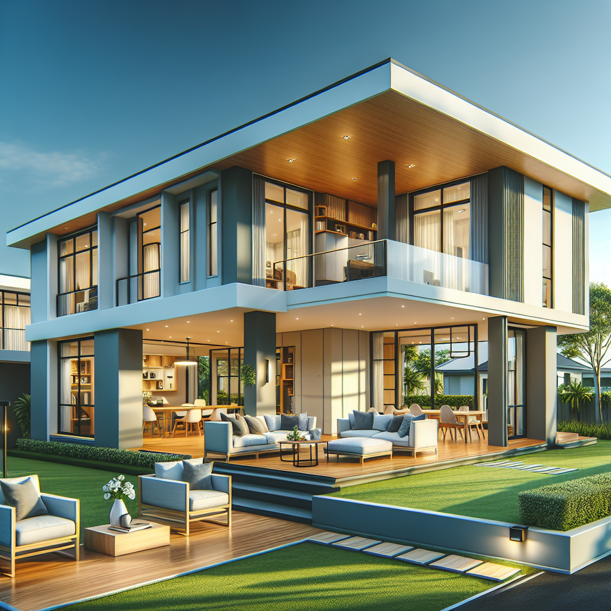
------------------------
HOUSE SPECIFICATIONS:
- Price : 3500000
- Area : 7350
- Number of bedrooms : 2
- Number of bathrooms : 1
- Number of storeys: 1
- Located on the main road
- There is no a guest room
- There is no a basement
- Hot water heating is not connected
- Air conditioning is not connected
- Number of parking places : 1
- Not a preffered area
- semi-furnished

Welcome to your dream home! 🏡✨ This stunning property is waiting for you to make it your own. With a price of $3,500,000, it offers incredible value for its impressive specifications. 

Situated on the main road, this spacious house spans an area of 7350 square feet, providing ample room for you and your loved ones. Although it features 2 bedrooms and 1 bathroom, the possibilities are endless when it comes to transforming this space into your ideal sanctuary. 

While it may not have a guest room or a basement, this house is ready to be customized to your liking. Imagine the potential of creating a cozy guest room or a stylish entertainment area in the future. 

Although hot water heating and air conditioning are not currently connected, you have the opportunity to design a climate-controlled oasis that suits your preferences. 

With a designated parking space, convenience is at your doorstep. And even though it may not be in a preferred area, this house offers the chance to create your own haven in a location that is perfect for you. 

Don't miss out on this incredible opportunity to own a semi-furnished house that holds endless possibilities. 🌟💫

#realestate #dreamhome #forsale #property #realestateforsale #homeforsale #luxuryrealestate #housegoals #househunting #housesofinstagram
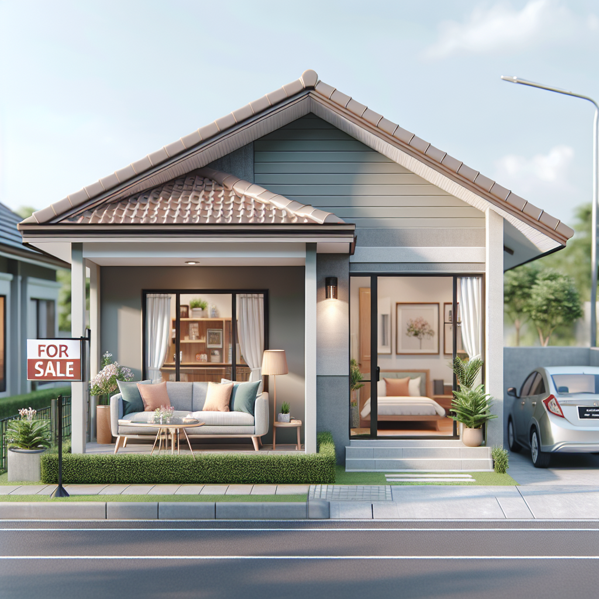
------------------------
HOUSE SPECIFICATIONS:
- Price : 3220000
- Area : 4320
- Number of bedrooms : 3
- Number of bathrooms : 1
- Number of storeys: 1
- It is not located on the main road
- There is no a guest room
- There is no a basement
- Hot water heating is not connected
- Air conditioning is not connected
- Number of parking places : 1
- Not a preffered area
- unfurnished

🏡 Welcome to your dream home! 🌟

Escape to this charming oasis tucked away from the hustle and bustle of the main road. 🌳 With a price of just $3,220,000, this spacious 3-bedroom, 1-bathroom single-storey house is waiting to become your sanctuary. 😍

Imagine waking up to the gentle rays of sunlight streaming through the windows, illuminating the 4,320 square feet of pure bliss. ✨ Whether you're starting a family or looking for a cozy retreat, this home offers the perfect balance of comfort and convenience. 

While it may not have a guest room or a basement, it compensates with its warm and inviting atmosphere. 🏠 Picture yourself hosting intimate gatherings in the open living area, where laughter and memories will fill the air. 🎉

Although hot water heating and air conditioning are not currently connected, you have the opportunity to customize this space to fit your desires. 💡 And with a parking place for your convenience, you'll never have to worry about finding a spot when you return home.

Don't miss out on this hidden gem! 💎 Join the ranks of satisfied homeowners and make this house your own. 🏡💙

#realestate #dreamhome #forsale #property #realestateforsale #homeforsale #housegoals #househunting #housesofinstagram
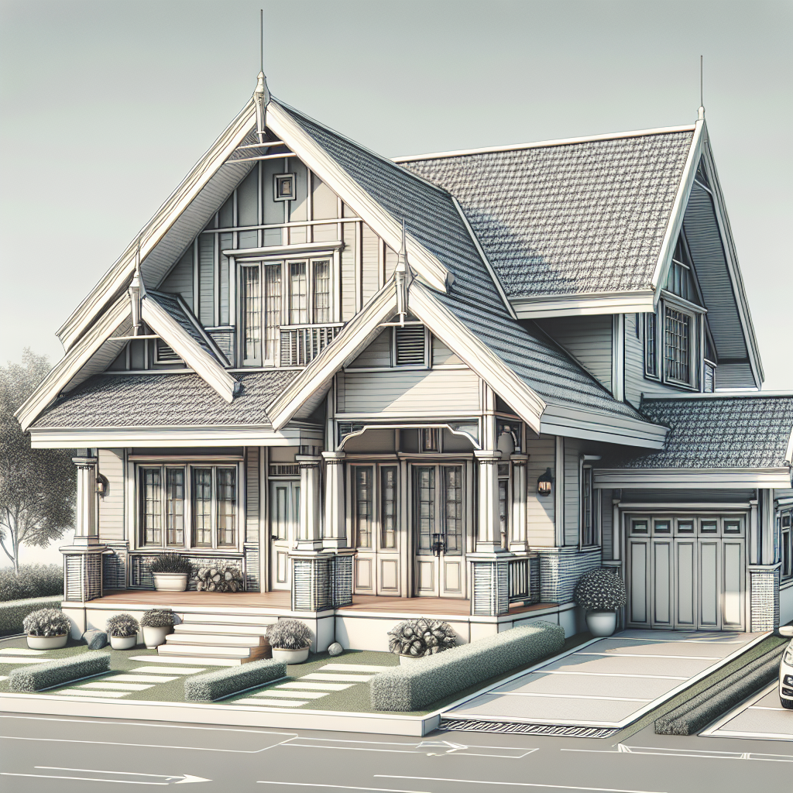
------------------------
HOUSE SPECIFICATIONS:
- Price : 12250000
- Area : 9960
- Number of bedrooms : 3
- Number of bathrooms : 2
- Number of storeys: 2
- Located on the main road
- There is no a guest room
- There is a basement
- Hot water heating is not connected
- Air conditioning is not connected
- Number of parking places : 2
- Preferred area
- semi-furnished

🏡 Welcome to your dream home! 🌟

✨ This stunning property is located on the main road, offering convenience and easy access to all your favorite spots. With 9960 sq.ft. of space, this spacious home is perfect for creating lasting memories with your loved ones.

💤 Imagine waking up in one of the 3 cozy bedrooms, feeling refreshed and ready to take on the day. 🛀 Pamper yourself in one of the 2 elegant bathrooms, designed with your comfort in mind.

🌳 Need extra storage space? No worries! This home comes with a basement, providing ample room for all your belongings. 🚗 With 2 parking places, you'll never have to worry about finding a spot for your vehicles.

🌞 While hot water heating and air conditioning are not currently connected, you have the opportunity to customize this home to your liking. 🛋️ The house is semi-furnished, allowing you to add your personal touch and make it truly yours.

💰 Priced at just $12,250,000, this property offers incredible value for its prime location and spaciousness. Don't miss out on this amazing opportunity to own your dream home!

🔑 Contact us today to schedule a viewing and make this house your own. 📞🏡

#realestate #dreamhome #forsale #property #realestateforsale #homeforsale #luxuryrealestate #housegoals #househunting #housesofinstagram
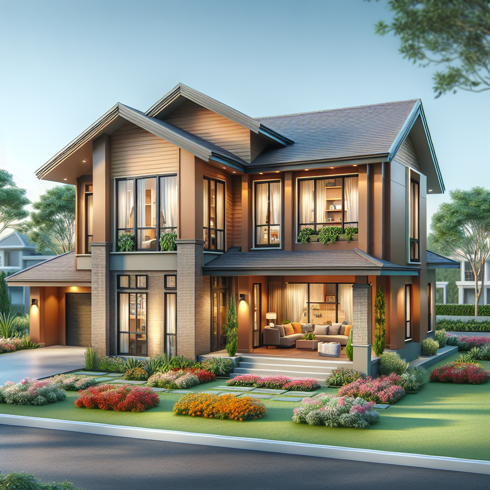
------------------------
HOUSE SPECIFICATIONS:
- Price : 3118850
- Area : 2398
- Number of bedrooms : 3
- Number of bathrooms : 1
- Number of storeys: 1
- Located on the main road
- There is no a guest room
- There is no a basement
- Hot water heating is not connected
- Air conditioning is not connected
- Number of parking places : 0
- Preferred area
- semi-furnished

Welcome to your dream home! 🏡✨ This stunning property is waiting for you to make it your own. With 3 spacious bedrooms and 1 bathroom, it's perfect for creating beautiful memories with your loved ones. Imagine waking up every morning to the warm sunlight streaming through the windows, filling the rooms with a cozy ambiance. 

Located on the main road, this house offers convenience and easy access to all the amenities you need. Whether you're looking for a place to call home or an investment opportunity, this property is a hidden gem. 

Although it doesn't have a guest room or a basement, the open layout and semi-furnished design give you the freedom to customize the space to suit your unique style. Picture yourself hosting intimate gatherings with friends and family, creating a warm and inviting atmosphere that everyone will love.

While hot water heating and air conditioning are not connected, you have the opportunity to install these features and create the perfect environment for year-round comfort. Plus, with the preferred area and a price of just $3,118,850, this house is an incredible value.

Don't miss out on this amazing opportunity! Contact us today to schedule a viewing and start living your dream. 🌟💫

#realestate #dreamhome #forsale #property #realestateforsale #homeforsale #luxuryrealestate #housegoals #househunting #housesofinstagram
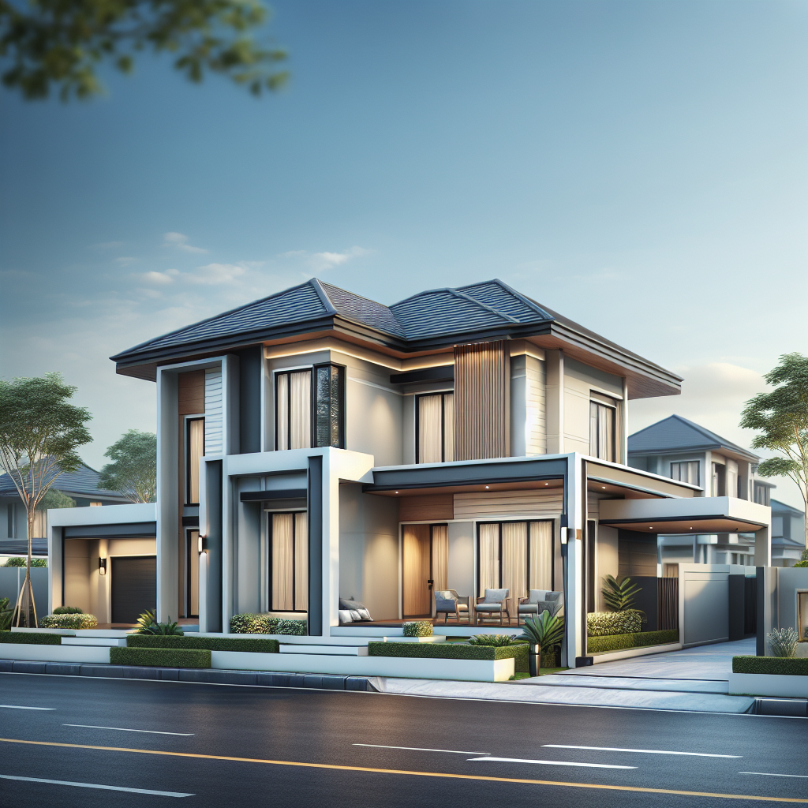
------------------------
HOUSE SPECIFICATIONS:
- Price : 4340000
- Area : 4075
- Number of bedrooms : 3
- Number of bathrooms : 1
- Number of storeys: 1
- Located on the main road
- There is a guest room
- There is a basement
- Hot water heating is not connected
- Air conditioning is not connected
- Number of parking places : 2
- Not a preffered area
- semi-furnished

🏡 Welcome to your dream home! 🌟

Introducing our latest gem, nestled in a prime location on the main road. This stunning one-storey beauty boasts a spacious area of 4075 sqft, offering you the perfect canvas to create a lifetime of memories. 💫

With 3 cozy bedrooms, this home is perfect for your growing family. Imagine waking up to the warm sunlight streaming through the windows, filling every corner with a sense of tranquility. 🌞

Step into the elegant guest room, where your loved ones can relax and unwind. And don't forget about the basement, a versatile space that can be transformed into your personal sanctuary or a lively entertainment area. The possibilities are endless! 🎉

While hot water heating and air conditioning are not connected, you have the opportunity to design your own climate control system, tailored to your preferences. 🌬️

Parking will never be a hassle with 2 convenient parking places. 🚗🚗

Although not in a preferred area, this home offers incredible potential. With a little love and your personal touch, you can transform this semi-furnished haven into your own slice of paradise. 🏝️

💰 Priced at $4,340,000, this is an opportunity you don't want to miss! 💸

So, are you ready to embark on a journey to find your forever home? 🏡💕

#realestate #dreamhome #forsale #property #realestateforsale #homeforsale #luxuryrealestate #housegoals #househunting #housesofinstagram
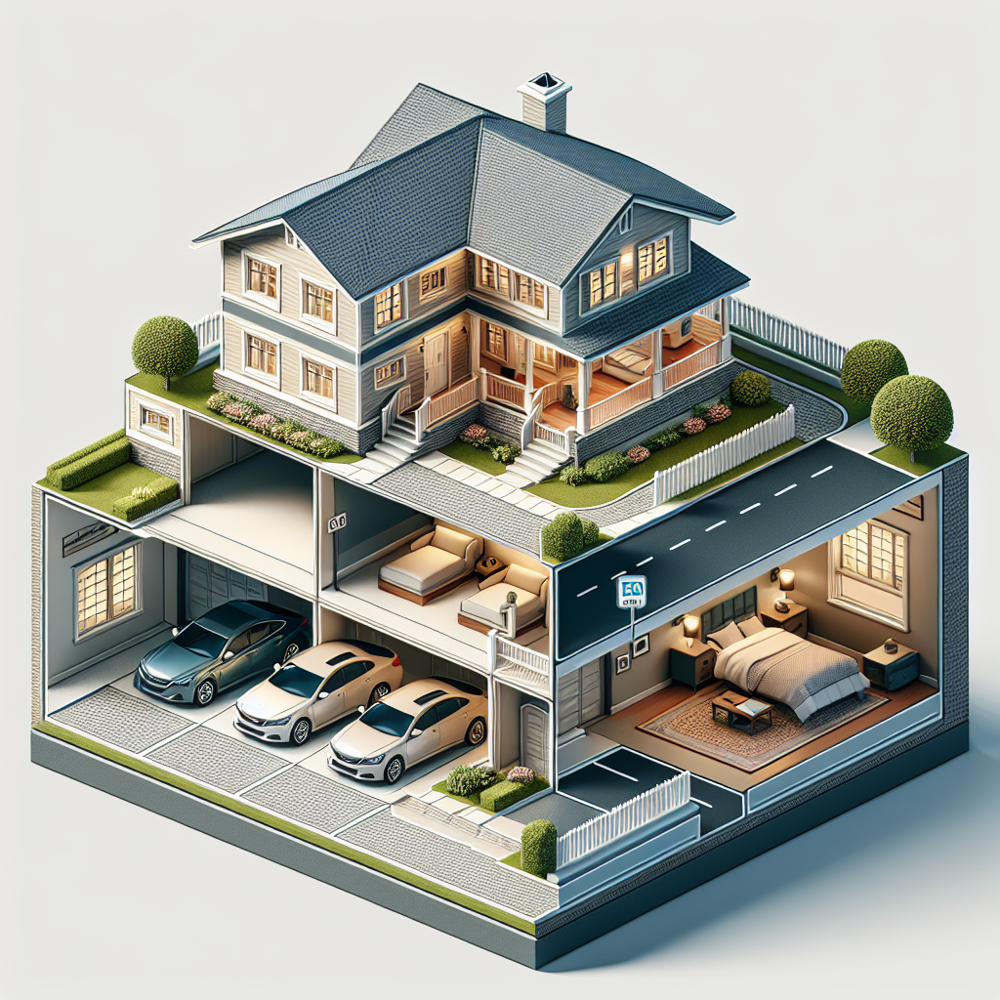
------------------------
HOUSE SPECIFICATIONS:
- Price : 4620000
- Area : 3880
- Number of bedrooms : 3
- Number of bathrooms : 2
- Number of storeys: 2
- Located on the main road
- There is no a guest room
- There is a basement
- Hot water heating is not connected
- Air conditioning is not connected
- Number of parking places : 2
- Not a preffered area
- semi-furnished

Welcome to your dream home! 🏡 This stunning property is waiting to be called yours. With a price of $4,620,000, it offers incredible value for its impressive features. 

Spread across a spacious area of 3,880 square feet, this home boasts 3 cozy bedrooms and 2 luxurious bathrooms. Perfect for a growing family or those who love to entertain, this 2-storey gem is sure to impress. 

Conveniently located on the main road, accessibility is never an issue. And with 2 parking spaces, you'll never have to worry about finding a spot for your vehicles. 

Although it's not in a preferred area, this house has so much to offer. From the inviting basement to the semi-furnished interior, there's plenty of room to make it your own. 

Imagine the possibilities! Create lasting memories in this charming home, where every corner has a story to tell. 

Don't miss out on this incredible opportunity. Contact us today to schedule a viewing and make this house your forever home. 🌟

#realestate #dreamhome #forsale #property #realestateforsale #homeforsale #luxuryrealestate #housegoals #househunting #housesofinstagram
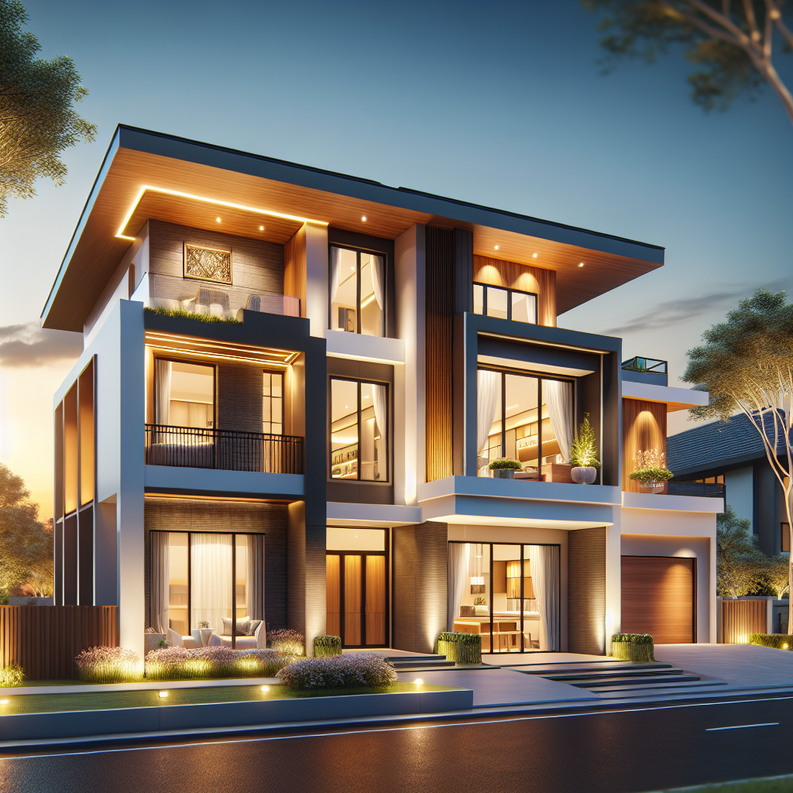
------------------------
HOUSE SPECIFICATIONS:
- Price : 6195000
- Area : 5500
- Number of bedrooms : 3
- Number of bathrooms : 2
- Number of storeys: 1
- Located on the main road
- There is a guest room
- There is a basement
- Hot water heating is not connected
- Air conditioning is not connected
- Number of parking places : 2
- Preferred area
- furnished

Welcome to your dream home! 🏡✨ This stunning property is a true gem, located on the main road in a preferred area. With a price of just $6,195,000, it offers incredible value for its impressive features. 

Step inside and be amazed by the spaciousness of this 5500 sqft home. With 3 bedrooms and 2 bathrooms, it's perfect for a growing family or those who love to entertain. The single-storey layout ensures easy accessibility and convenience.

Imagine hosting guests in the elegant guest room, or utilizing the basement for additional living space or storage. While hot water heating and air conditioning are not currently connected, the potential to create your ideal climate-controlled oasis is limitless.

Parking will never be an issue with the two parking places available. And the best part? This home comes fully furnished, so you can move right in and start living your best life.

Don't miss out on this incredible opportunity! Contact us today to schedule a viewing and make this dream home yours. 📞💫

#realestate #dreamhome #forsale #property #realestateforsale #homeforsale #luxuryrealestate #housegoals #househunting #housesofinstagram
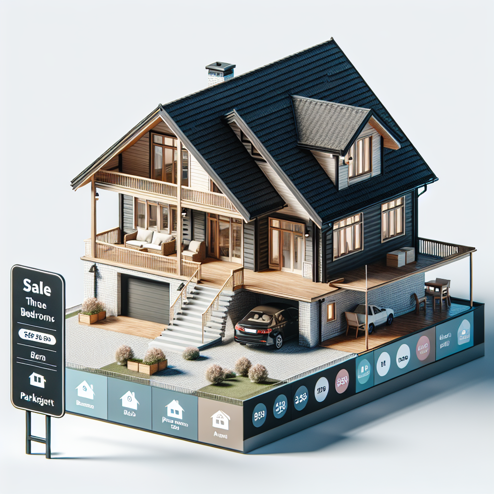
------------------------
HOUSE SPECIFICATIONS:
- Price : 4007500
- Area : 3460
- Number of bedrooms : 4
- Number of bathrooms : 1
- Number of storeys: 2
- Located on the main road
- There is no a guest room
- There is no a basement
- Hot water heating is not connected
- Air conditioning is connected
- Number of parking places : 0
- Not a preffered area
- semi-furnished

🏡 Welcome to your dream home! 🌟 This stunning 2-storey house is waiting for you to make it your own. With 4 spacious bedrooms and 1 luxurious bathroom, it's perfect for creating lasting memories with your loved ones. 💫

Located on the main road, this gem offers easy access to all the amenities you need. Imagine waking up to the gentle breeze and the sound of birds chirping, as you sip your morning coffee on the balcony. 🌅

Although there is no guest room or basement, this house is designed to maximize space and functionality. The semi-furnished interior provides a blank canvas for you to unleash your creativity and turn it into your personal oasis. ✨

While hot water heating is not connected, you'll stay cool and comfortable with the air conditioning system. No more sweltering summers or sleepless nights! 😎

Although there are no parking places, don't let that deter you. With the convenience of being located on the main road, parking will never be an issue. 🚗

Priced at $4,007,500, this home offers incredible value for its size and location. Don't miss out on this opportunity to own your dream home! Contact us today to schedule a viewing. 📞💼

#realestate #dreamhome #forsale #property #realestateforsale #homeforsale #luxuryrealestate #housegoals #househunting #housesofinstagram
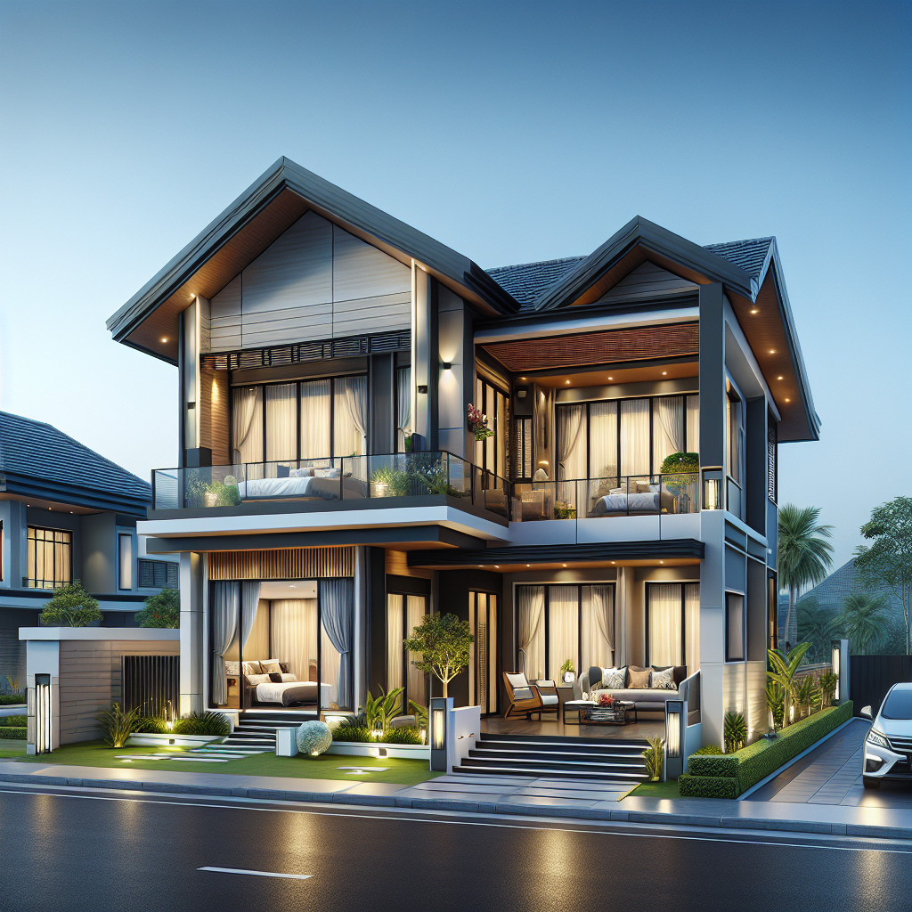
------------------------
